# R-Sim: Parallel Simulation Engine Design

## 1. Motivation

As simulation models grow in complexity, the single-threaded execution of the `SimulationEngine` becomes a bottleneck. To support larger, more complex systems with many interacting components, we must evolve the engine to run in a parallel environment. This document outlines a design for a Parallel Discrete-Event Simulation (PDES) capability for `rsim`.

The primary challenge in PDES is maintaining time synchronization across multiple threads to ensure causal consistency. An event at time `T` cannot be processed if an event from another thread at time `T-1` has not yet been received.

## 2. Proposed Strategy: Static Analysis and Graph Partitioning

We will adopt a hybrid strategy that performs a static analysis of the simulation's communication graph before execution. The goal is to intelligently partition the components across multiple threads to minimize the need for expensive cross-thread synchronization.

This process involves three main phases: Analysis, Partitioning, and Execution.

### Phase 1: Dependency Graph Construction

Before the simulation begins, we will construct a directed graph representing the communication topology of the user-defined components.

-   **Nodes**: Each component instance is a node in the graph.
-   **Edges**: A directed edge is created from Component `A` to Component `B` if `A` can emit an event type that `B` includes in its `subscriptions()`.

This creates a static map of *potential* event pathways.

### Phase 2: Graph Weighting via Profiling

Potential pathways are not enough; we need to know the actual communication load. The graph will be weighted by performing a short, single-threaded profiling run.

1.  **Monitor Events**: The `SimulationEngine` will be augmented with a monitoring hook.
2.  **Count Traffic**: During the profiling run, this hook will count every event sent between each pair of components.
3.  **Assign Weights**: The resulting counts become the weights of the corresponding edges in the graph. The edge weight `W(A, B)` represents the measured communication frequency from `A` to `B`.

### Phase 3: Graph Partitioning

With the weighted communication graph, we can now group components for thread assignment. This is a classic **graph partitioning** problem.

1.  **Algorithm**: We will use a graph partitioning algorithm (e.g., METIS or a similar library) to divide the graph's nodes into `N` partitions, where `N` is the number of available threads.
2.  **Objective**: The algorithm's goal is to **minimize the total weight of edges that are cut** (i.e., edges that connect nodes in different partitions).
3.  **Outcome**: This process naturally groups "chatty" components together on the same thread, minimizing expensive cross-thread traffic. The output is a clear assignment of each component to a specific thread.

#### Visualization of the Process

```mermaid
graph TD;
    subgraph "Phase 1: Build Graph";
        C1(Component 1);
        C2(Component 2);
        C3(Component 3);
        C4(Component 4);
        C1 -- subscribes to --> C2;
        C2 -- subscribes to --> C3;
        C1 -- subscribes to --> C4;
        C3 -- subscribes to --> C4;
    end

    subgraph "Phase 2: Weight Graph (Profile Run)";
        wC1(Component 1);
        wC2(Component 2);
        wC3(Component 3);
        wC4(Component 4);
        wC1 -- "100 events" --> wC2;
        wC2 -- "98 events" --> wC3;
        wC1 -- "5 events" --> wC4;
        wC3 -- "4 events" --> wC4;
    end

    subgraph "Phase 3: Partition Graph (for 2 Threads)";
        subgraph "Thread 1";
            pC1(Component 1);
            pC2(Component 2);
            pC3(Component 3);
        end
        subgraph "Thread 2";
            pC4(Component 4);
        end
        
        pC1 -- "100 events (Internal)" --> pC2;
        pC2 -- "98 events (Internal)" --> pC3;
        pC1 -- "<b style='color:red'>CUT - 5 events (External)</b>" --> pC4;
        pC3 -- "<b style='color:red'>CUT - 4 events (External)</b>" --> pC4;
    end
    
    Phase1-->Phase2;
    Phase2-->Phase3;

    style Thread1 fill:#f9f,stroke:#333,stroke-width:2px;
    style Thread2 fill:#ccf,stroke:#333,stroke-width:2px;
```

## 4. Parallel Execution and Synchronization

Once components are partitioned, the simulation can run in parallel.

-   Each thread will host its own local `EventScheduler` managing the events for its assigned components.
-   A synchronization protocol is required to manage events that cross thread boundaries.

We will primarily investigate a **Conservative Synchronization** mechanism.

### Conservative Synchronization

This "look before you leap" approach avoids causality errors by ensuring a thread only processes an event if it's certain it will not receive an earlier event from another thread.

-   **Lookahead**: The key optimization. When a component `A` on Thread 1 sends an event to component `B` on Thread 2, it can provide a "lookahead" value `L`. This is a guarantee that `A` will not send another event to `B` before `current_time + L`.
-   **Safe Time**: Thread 2 knows it can safely process all its local events up to the minimum lookahead value it has received from all its external inputs.
-   **NULL Messages**: To avoid deadlocks where one thread is waiting for a lookahead guarantee that may not come, threads will periodically broadcast `NULL` messages containing updated lookahead information.

## 5. Required Architectural Changes

Supporting this design requires changes to the `rsim` core:

1.  **`SimulationEngine`**: Must be updated to manage the Analysis and Partitioning phases, and to spawn and manage the threads for the Execution phase.
2.  **`EventScheduler`**: Will be instantiated per-thread. It needs a mechanism (e.g., an MPSC channel) to receive external events from other threads.
3.  **`BaseComponent` Trait**: May need a new optional method, `fn lookahead(&self) -> TimeDelta`, to allow components to declare their minimum time between events. This provides critical information for the conservative synchronization protocol.
4.  **Inter-Thread Communication**: A robust communication layer (likely built on Rust's channels) will be needed to pass events and synchronization messages (`NULL` messages) between threads. 