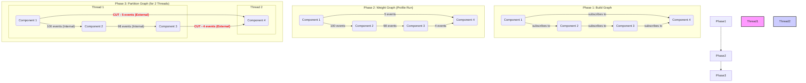

# R-Sim: Parallel Simulation Engine Design

## 1. Motivation

To address performance bottlenecks in complex simulations, this document outlines a design for a Parallel Discrete-Event Simulation (PDES) engine for `rsim`. The core challenge is maintaining causal consistency across threads, ensuring that an event at time `T` is not processed before a `T-1` event from another thread.

## 2. Proposed Strategy: Static Graph Partitioning

Our strategy is to partition components across threads based on a static analysis of their communication graph. This minimizes expensive cross-thread synchronization. The process has three main phases.

### Phase 1: Dependency Graph Construction

First, we build a dependency graph of all components.

-   **Nodes**: Each component instance.
-   **Edges**: A directed edge from `A` to `B` exists if component `A` can emit an event that `B` subscribes to. This creates a static map of *potential* event pathways.

### Phase 2: Graph Weighting via Profiling

To understand the real communication load, we weight the graph's edges by performing a short, single-threaded profiling run.

1.  **Monitor Events**: The `SimulationEngine` is augmented with a monitoring hook.
2.  **Count Traffic**: The hook counts every event sent between each pair of components.
3.  **Assign Weights**: The counts become the edge weights, where `W(A, B)` represents the measured communication frequency from `A` to `B`.

### Phase 3: Graph Partitioning

With the weighted graph, we group components for thread assignment using a graph partitioning algorithm (e.g., METIS). The algorithm's objective is to **minimize the total weight of cut edges**—those connecting components in different partitions.

This process groups "chatty" components onto the same thread, minimizing expensive cross-thread traffic and producing a clear assignment of each component to a thread.

#### Visualization of the Process

```mermaid
graph TD;
    subgraph "Phase 1: Build Graph";
        C1(Component 1);
        C2(Component 2);
        C3(Component 3);
        C4(Component 4);
        C1 -- subscribes to --> C2;
        C2 -- subscribes to --> C3;
        C1 -- subscribes to --> C4;
        C3 -- subscribes to --> C4;
    end

    subgraph "Phase 2: Weight Graph (Profile Run)";
        wC1(Component 1);
        wC2(Component 2);
        wC3(Component 3);
        wC4(Component 4);
        wC1 -- "100 events" --> wC2;
        wC2 -- "98 events" --> wC3;
        wC1 -- "5 events" --> wC4;
        wC3 -- "4 events" --> wC4;
    end

    subgraph "Phase 3: Partition Graph (for 2 Threads)";
        subgraph "Thread 1";
            pC1(Component 1);
            pC2(Component 2);
            pC3(Component 3);
        end
        subgraph "Thread 2";
            pC4(Component 4);
        end
        
        pC1 -- "100 events (Internal)" --> pC2;
        pC2 -- "98 events (Internal)" --> pC3;
        pC1 -- "<b style='color:red'>CUT - 5 events (External)</b>" --> pC4;
        pC3 -- "<b style='color:red'>CUT - 4 events (External)</b>" --> pC4;
    end
    
    Phase1-->Phase2;
    Phase2-->Phase3;

    style Thread1 fill:#f9f,stroke:#333,stroke-width:2px;
    style Thread2 fill:#ccf,stroke:#333,stroke-width:2px;
```

## 4. Parallel Execution and Synchronization

Once partitioned, the simulation runs in parallel, with each thread hosting a local `EventScheduler` for its assigned components. To manage events that cross thread boundaries, we will use a **Conservative Synchronization** mechanism.

### Conservative Synchronization

This "look before you leap" approach avoids causality errors. A thread only processes an event if it is certain it will not receive an earlier event from another thread.

-   **Lookahead (`L`)**: The key optimization. Lookahead is a promise about the minimum time before a component generates a future external event. When component `A` on Thread 1 has a lookahead `L`, it guarantees it will not send an event to another thread with a timestamp earlier than `current_time + L`.
-   **Safe Time**: Thread 2 knows it can safely process all its local events up to the minimum lookahead value it has received from all its external inputs.
-   **NULL Messages**: To avoid deadlock, threads periodically broadcast `NULL` messages containing updated lookahead information, even if no real event is sent.

## 5. Choice of Parallelism Model: `std::thread` vs. Rayon

For the core simulation engine, we will adopt a **Task Parallelism** model using `std::thread`. This is necessary because our design requires a fixed number of long-running, stateful threads, each managing its own event queue and communicating explicitly with others. This gives us the direct control essential for the conservative synchronization protocol.

Rayon, while powerful, is optimized for **Data Parallelism** (e.g., `par_iter`). Its work-stealing model is not a natural fit for our main simulation loop, which involves persistent state and continuous, targeted communication between specific threads.

However, Rayon remains a valuable tool for specific tasks:
-   **Graph Analysis:** During the pre-simulation phase, Rayon can parallelize complex, custom graph partitioning or analysis algorithms.
-   **Component-Level Parallelism:** Individual components can use Rayon internally to parallelize heavy workloads within their event handlers.

## 6. Required Architectural Changes

Supporting this design requires these changes to the `rsim` core:

1.  **`SimulationEngine`**: Must be updated to manage the analysis and partitioning phases, and to spawn and manage the execution threads.
2.  **`EventScheduler`**: Will be instantiated per-thread, with a channel to receive external events from other threads.
3.  **`Component` Trait**: Will be updated with an associated constant for lookahead: `const LOOKAHEAD: TimeDelta`. This allows a component to declare a fixed, minimum time between an incoming and an outgoing event. A default value of 0 will be provided.
4.  **Inter-Thread Communication**: A robust communication layer (likely using Rust's MPSC channels) is needed to pass events and `NULL` messages between threads. 