# Event-Based Simulator Architecture Diagrams

## Class Architecture

## Component Registration Workflow

```mermaid
sequenceDiagram
    participant C as Component
    participant SE as SimulationEngine
    participant EM as EventManager
    
    C->>SE: register
    SE->>EM: register_component(component)
    EM->>EM: Store component
    EM->>EM: Process subscriptions
    loop For each subscription
        EM->>EM: Add to event_type → components mapping
    end
    EM->>SE: Registration complete
```

## Event Processing Workflow

## Time-Based Event Flow

## Priority Queue Structure

## Example: Ping-Pong Workflow

## Component State Machine

## System Overview

