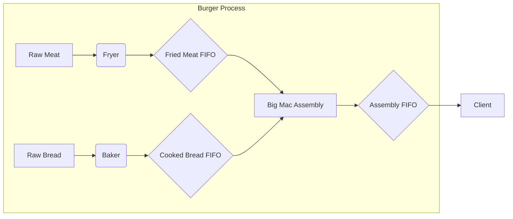

## Burger Production Process Description

This simulation models a burger production line with the following components and behavior:

### Production Components
- **Fryer**: Processes raw meat into fried meat patties. Stops frying when the Fried Meat FIFO is full.
- **Baker**: Processes raw bread into cooked buns. Stops baking when the Cooked Bread FIFO is full.
- **Big Mac Assembly**: Combines fried meat and cooked bread to create complete burgers. Stops assembling when the Assembly FIFO is full.

### FIFO Buffers
- **Fried Meat FIFO**: Stores fried meat patties between fryer and assembly
- **Cooked Bread FIFO**: Stores cooked buns between baker and assembly
- **Assembly FIFO**: Stores completed burgers between assembly and client

### Client Behavior
The client component generates demand by ordering a random number of burgers each simulation cycle. The number of burgers ordered follows a normal distribution, creating realistic demand patterns.

### Flow Control
Each production component (Fryer, Baker, Assembler) implements backpressure control - they halt production when their output FIFO reaches capacity, preventing overflow and maintaining system stability.