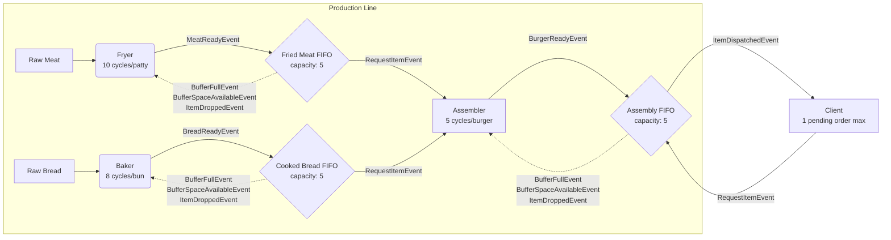

# Burger Production Simulation Design

## System Overview



## Component Responsibilities

### Production Components

#### Fryer
- **Purpose**: Converts raw meat into fried meat patties
- **Processing Time**: 10 simulation cycles per patty
- **Behavior Flags**:
  - `auto_produce`: true in BufferBased mode, false in OrderBased mode
- **Behavior**:
  - **BufferBased Mode**: Self-schedules production, pausing/resuming based on `BufferFullEvent`/`BufferSpaceAvailableEvent`.
  - **OrderBased Mode**:
    - Upon receiving `PlaceOrderEvent(quantity)`, stores the target quantity.
    - Produces items until the quantity is fulfilled, meaning all items have been successfully accepted by the buffer.
    - If an item is rejected (`ItemDroppedEvent`), production of new items is paused. The completed item is held and retried upon `BufferSpaceAvailableEvent`.
  - Sends `MeatReadyEvent` to buffer when a patty completes.
  - Supports concurrent processing (configurable).

#### Baker
- **Purpose**: Converts raw bread into cooked buns
- **Processing Time**: 8 simulation cycles per bun
- **Behavior Flags**:
  - `auto_produce`: true in BufferBased mode, false in OrderBased mode
- **Behavior**: Identical to Fryer, including the stateful `OrderBased` logic to fulfill an order quantity and handle backpressure by retrying.

#### Assembler
- **Purpose**: Combines meat and bread into complete burgers
- **Processing Time**: 5 simulation cycles per burger
- **Behavior Flags**:
  - `auto_produce`: true in BufferBased mode, false in OrderBased mode
- **Behavior**:
  - **BufferBased Mode**:
    - Production triggered via `TriggerProductionEvent` (self-sent).
    - Monitors available ingredients via `ItemAddedEvent` from buffers.
    - Sends `RequestItemEvent` to both ingredient buffers when ready.
  - **Shared Behavior**:
    - Only starts assembly when both ingredients confirmed available.
    - Sends `BurgerReadyEvent` to AssemblyBuffer when complete.
    - Receives `ItemDroppedEvent` if AssemblyBuffer rejects burger (full).
    - Implements same backpressure mechanism as producers.

### FIFO Buffer Components

All buffers share common behavior with type-specific implementations:

#### FriedMeatBuffer / CookedBreadBuffer / AssemblyBuffer
- **Capacity**: 5 items (configurable)
- **Behaviors**:
  - Accepts items from upstream producers if space available.
  - If full, rejects item and sends `ItemDroppedEvent` back to producer
  - Broadcasts `ItemAddedEvent` when items successfully added
  - Responds to `RequestItemEvent` from downstream consumers (Assembler, Client)
  - Implements backpressure:
    - Sends `BufferFullEvent` when reaching capacity
    - Sends `BufferSpaceAvailableEvent` when space opens up
  - Maintains FIFO ordering for fairness


### Demand Component

#### Client
- **Purpose**: Generates customer orders, tracks their fulfillment, and consumes burgers.
- **Order Pattern**: Configurable quantity per order (e.g., 1-5 burgers)
- **Order Frequency**: Every 15 simulation cycles
- **Order Constraint**: Only one **pending** order at a time. A new order is only generated after the previous one is fulfilled.
- **Behaviors**:
  - Self-schedules order generation via `GenerateOrderEvent`, creating an internal pending order with a unique `order_id` and `quantity`.
  - Subscribes to `ItemAddedEvent` from the AssemblyBuffer.
  - When an order is pending and a burger is available, it sends `RequestItemEvent` to the AssemblyBuffer.
  - Upon receiving `ItemDispatchedEvent`, it decrements the remaining quantity for its pending order.
  - When the order quantity reaches zero, it self-generates an `OrderFulfilledEvent` to finalize the order and schedule the next `GenerateOrderEvent`.
  - Tracks order statistics: pending, fulfilled, total generated.
  - Uses seeded RNG for reproducible simulations

## Event Flow and Communication

### Production Events
1. **TriggerProductionEvent**: Generic production initiation
   - In BufferBased mode: Self-scheduled by producers
   - In OrderBased mode: Sent by downstream components (future)
2. **MeatReadyEvent / BreadReadyEvent**: Producer → Buffer item completion
3. **BurgerReadyEvent**: Assembler → AssemblyBuffer completion


### Buffer Management Events
1. **ItemAddedEvent**: Buffer → Subscribers (broadcast)
2. **RequestItemEvent**: Consumer → Buffer (pull request)
3. **ItemDispatchedEvent**: Buffer → Consumer (response to `RequestItemEvent`)
4. **BufferFullEvent**: Buffer → Producers (backpressure)
5. **BufferSpaceAvailableEvent**: Buffer → Producers (resume)
6. **ItemDroppedEvent**: Buffer → Producer (item rejected when full, for production backpressure only)

### Demand Events
1. **GenerateOrderEvent**: Client self-scheduling
2. **PlaceOrderEvent**: Client → Fryer + Baker (OrderBased mode only)
3. **OrderFulfilledEvent**: Client → Client (self-event)

## Production Workflow

### Initialization Sequence
1. All components register with simulation engine
2. Components configured with behavior flags based on `production_mode`
3. Initial events scheduled (BufferBased mode):
   - Fryer: `TriggerProductionEvent` at cycle 1 (if auto_produce=true)
   - Baker: `TriggerProductionEvent` at cycle 1 (if auto_produce=true)
   - Assembler: `TriggerProductionEvent` at cycle 5 (if auto_produce=true)
   - Client: `GenerateOrderEvent` at cycle 20

### BufferBased Workflow (Steady-State)
1. **Producers** (Fryer/Baker) and **Assembler** continuously create items, regulated by backpressure from their target buffers.
2. **Client** generates an order (e.g., for 3 burgers) and holds it in a `pending` state.
3. The **AssemblyBuffer** broadcasts an `ItemAddedEvent` when a new burger is added.
4. The **Client**, listening for this event, sends a `RequestItemEvent` to pull an available burger.
5. The **AssemblyBuffer** fulfills the request by sending an `ItemDispatchedEvent` with the burger. The Client decrements its pending order quantity.
6. The Client repeats steps 4-5 until the order quantity is met.
7. Once fulfilled, the Client triggers an internal `OrderFulfilledEvent` and schedules the next `GenerateOrderEvent`.

### OrderBased Workflow (Steady-State)
1.  **Order Placement**: The Client generates a pending order (e.g., for 2 burgers) and sends `PlaceOrderEvent`s to the Fryer and Baker to request the total number of ingredients required.
2.  **Ingredient Production**: The Fryer and Baker produce their respective components.
3.  **Buffering Ingredients**: Upon completion, the producer sends its item to its corresponding buffer.
4.  **Ingredient Notification**: The buffer accepts the item and broadcasts an `ItemAddedEvent`.
5.  **Assembly Coordination**: The Assembler listens for these `ItemAddedEvent`s to know when ingredients are available.
6.  **Ingredient Request**: Once ingredients are available, the Assembler sends `RequestItemEvent`s to retrieve them.
7.  **Assembly & Buffering**: The Assembler creates the burger and sends it to the `AssemblyBuffer`. The `AssemblyBuffer` then broadcasts an `ItemAddedEvent`.
8.  **Order Fulfillment**: The **Client**, listening for the `ItemAddedEvent` from the `AssemblyBuffer`, sends a `RequestItemEvent` to retrieve the completed burger. This process is repeated until the Client has received all burgers for its pending order. Upon fulfillment, it is free to generate a new one.

### Backpressure Mechanism
```
Buffer Full → BufferFullEvent → Producer.is_production_stopped = true
                                        ↓
                                 No new TriggerProductionEvent scheduled
                                        ↓
Item Consumed → Buffer has space → BufferSpaceAvailableEvent
                                        ↓
                          Producer.is_production_stopped = false
                                        ↓
                        Schedule new TriggerProductionEvent (if auto_produce=true)
```

## Events Implementation

### Production Events

#### TriggerProductionEvent
- **Purpose**: Initiates production cycle in a component
- **Data**: None (trigger only)
- **Source**: Self (BufferBased mode) or Client via PlaceOrderEvent (OrderBased mode)
- **Target**: Single production component (Fryer, Baker, or Assembler)
- **Usage**: Starts production timer

#### MeatReadyEvent
- **Purpose**: Signals completion of a fried meat patty
- **Data**: `item_id: String`
- **Source**: Fryer
- **Target**: FriedMeatBuffer
- **Usage**: Attempts to add completed patty to buffer.

#### BreadReadyEvent
- **Purpose**: Signals completion of a cooked bun
- **Data**: `item_id: String`
- **Source**: Baker
- **Target**: CookedBreadBuffer
- **Usage**: Attempts to add completed bun to buffer.

#### BurgerReadyEvent
- **Purpose**: Signals completion of an assembled burger
- **Data**: `item_id: String`
- **Source**: Assembler
- **Target**: AssemblyBuffer
- **Usage**: Completes burger production.

### Buffer Management Events

#### ItemAddedEvent
- **Purpose**: Broadcasts that an item was successfully added to a buffer
- **Data**: `buffer_type: String`, `item_id: String`, `current_count: i32`
- **Source**: Any buffer component
- **Target**: All subscribers (broadcast)
- **Usage**: Notifies downstream consumers that items are available.

#### RequestItemEvent
- **Purpose**: Requests an item from a buffer
- **Data**: `requester_id: String`
- **Source**: Consumer component (Assembler or Client)
- **Target**: Specific buffer
- **Usage**: Pulls an item from the buffer FIFO queue. The buffer is expected to respond with an `ItemDispatchedEvent`.

#### ItemDispatchedEvent
- **Purpose**: Response to a `RequestItemEvent`, carrying the requested item.
- **Data**: `item_type: String`, `item_id: String`, `success: bool`
- **Source**: Any buffer component
- **Target**: The original requester component.
- **Usage**: Delivers the requested item to the consumer. The `success` flag indicates if an item was available.

#### BufferFullEvent
- **Purpose**: Signals that a buffer has reached capacity
- **Data**: `buffer_type: String`
- **Source**: Any buffer component
- **Target**: Upstream producer
- **Usage**: Implements backpressure to stop production

#### BufferSpaceAvailableEvent
- **Purpose**: Signals that a full buffer now has space
- **Data**: `buffer_type: String`
- **Source**: Any buffer component
- **Target**: Upstream producer
- **Usage**: Releases backpressure to resume production

#### ItemDroppedEvent
- **Purpose**: Notifies a producer that an item was rejected due to a full buffer.
- **Data**: `item_type: String`, `item_id: String`, `reason: String`
- **Source**: Any buffer component
- **Target**: The upstream producer that attempted to add the item.
- **Usage**: Allows a producer to halt and retry adding the same item later, a key part of the backpressure mechanism.

### Demand Events

#### GenerateOrderEvent
- **Purpose**: Triggers order generation in the Client
- **Data**: None (trigger only)
- **Source**: Client (self-scheduled)
- **Target**: Client
- **Usage**: Periodic trigger for order creation

#### PlaceOrderEvent
- **Purpose**: Places a burger order to trigger production directly. Used in `OrderBased` mode only.
- **Data**: `quantity: u32`
- **Source**: Client
- **Target**: Fryer + Baker (broadcast to trigger production)
- **Usage**: Kicks off the production chain for a specific quantity of burgers.

#### OrderFulfilledEvent
- **Purpose**: Notifies that an order has been completed
- **Data**: `order_id: String`, `fulfillment_time: u64`
- **Source**: Client
- **Target**: Client (self)
- **Usage**: Signals to the Client that its own pending order is complete. This is a self-targeted event used to update statistics and trigger the next `GenerateOrderEvent`.

## Configuration Parameters

The simulation supports extensive configuration via `BurgerSimulationConfig`:
- **Production Mode**: `ProductionMode` enum (BufferBased, OrderBased)
- **Processing Delays**: Frying (10), Baking (8), Assembly (5) cycles
- **Buffer Capacities**: Default 5 items each
- **Concurrent Processing**: Max items in process per component
- **Order Generation**: Interval (15), Quantity per order (configurable)
- **Simulation Duration**: Total cycles to run
- **Random Seed**: For reproducible order patterns

### Production Modes
- **BufferBased**: Producers continuously self-schedule production until buffers are full
- **OrderBased**: Production is triggered on-demand by a `PlaceOrderEvent` from the Client. Producers create ingredients for the pending order and place them in buffers. The Assembler then fetches these ingredients from the buffers to assemble the final product.