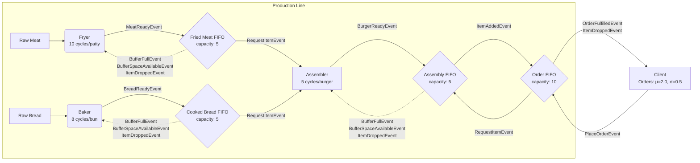

# Burger Production Simulation Design

## System Overview



## Component Responsibilities

### Production Components

#### Fryer
- **Purpose**: Converts raw meat into fried meat patties
- **Processing Time**: 10 simulation cycles per patty
- **Behavior**:
  - Self-schedules production via `StartFryingEvent`
  - Sends `MeatReadyEvent` to buffer when patty completes
  - Receives `ItemDroppedEvent` if buffer rejects item (full)
  - Monitors buffer capacity and halts on `BufferFullEvent`
  - Resumes production on `BufferSpaceAvailableEvent`
  - Supports concurrent processing (configurable)

#### Baker
- **Purpose**: Converts raw bread into cooked buns
- **Processing Time**: 8 simulation cycles per bun
- **Behavior**: Identical to Fryer but produces bread items (including handling `ItemDroppedEvent`)

#### Assembler
- **Purpose**: Combines meat and bread into complete burgers
- **Processing Time**: 5 simulation cycles per burger
- **Behavior**:
  - Monitors available ingredients via `ItemAddedEvent` from buffers
  - Sends `RequestItemEvent` to both ingredient buffers when ready
  - Only starts assembly when both ingredients confirmed available
  - Sends `BurgerReadyEvent` to AssemblyBuffer when complete
  - Receives `ItemDroppedEvent` if AssemblyBuffer rejects burger (full)
  - Tracks pending requests to avoid duplicates
  - Implements same backpressure mechanism as producers

### FIFO Buffer Components

All buffers share common behavior with type-specific implementations:

#### FriedMeatBuffer / CookedBreadBuffer / AssemblyBuffer
- **Capacity**: 5 items (configurable)
- **Behaviors**:
  - Accepts items from upstream producers if space available
  - If full, rejects item and sends `ItemDroppedEvent` back to producer
  - Broadcasts `ItemAddedEvent` when items successfully added
  - Responds to `RequestItemEvent` from downstream consumers
  - Implements backpressure:
    - Sends `BufferFullEvent` when reaching capacity
    - Sends `BufferSpaceAvailableEvent` when space opens up
  - Maintains FIFO ordering for fairness

#### OrderBuffer
- **Purpose**: Queues customer orders in FIFO order
- **Capacity**: 10 orders (configurable)
- **Behaviors**:
  - Accepts `PlaceOrderEvent` from Client (1 burger per order) if space available
  - If full, rejects order and sends `ItemDroppedEvent` back to Client
  - Listens for `ItemAddedEvent` from AssemblyBuffer
  - When burger available, sends `RequestItemEvent` to AssemblyBuffer for oldest order
  - Sends `OrderFulfilledEvent` back to Client when order complete
  - Maintains FIFO ordering to ensure fair order fulfillment

### Demand Component

#### Client
- **Purpose**: Generates customer orders and consumes burgers
- **Order Pattern**: 1 burger per order (simplified)
- **Order Frequency**: Every 15 simulation cycles
- **Behaviors**:
  - Self-schedules order generation via `GenerateOrderEvent`
  - Sends `PlaceOrderEvent` to OrderBuffer
  - Receives `OrderFulfilledEvent` when order complete
  - Receives `ItemDroppedEvent` if OrderBuffer rejects order (full)
  - Tracks order statistics: pending, fulfilled, dropped, total generated
  - Uses seeded RNG for reproducible simulations

## Event Flow and Communication

### Production Events
1. **StartFryingEvent / StartBakingEvent**: Self-scheduled production initiation
2. **MeatReadyEvent / BreadReadyEvent**: Producer → Buffer item completion
3. **StartAssemblyEvent**: Self-scheduled assembly initiation
4. **BurgerReadyEvent**: Assembler → AssemblyBuffer completion

### Buffer Management Events
1. **ItemAddedEvent**: Buffer → Subscribers (broadcast)
2. **RequestItemEvent**: Consumer → Buffer (pull request)
3. **BufferFullEvent**: Buffer → Producers (backpressure)
4. **BufferSpaceAvailableEvent**: Buffer → Producers (resume)
5. **ItemDroppedEvent**: Buffer → Producer (item rejected when full)

### Demand Events
1. **GenerateOrderEvent**: Client self-scheduling
2. **PlaceOrderEvent**: Client → OrderBuffer
3. **OrderFulfilledEvent**: OrderBuffer → Client

## Production Workflow

### Initialization Sequence
1. All components register with simulation engine
2. Initial events scheduled:
   - Fryer: `StartFryingEvent` at cycle 1
   - Baker: `StartBakingEvent` at cycle 1
   - Assembler: `StartAssemblyEvent` at cycle 5
   - Client: `GenerateOrderEvent` at cycle 20

### Steady-State Operation
1. **Producers** (Fryer/Baker) continuously create ingredients
2. **Buffers** accumulate items and manage flow control
3. **Assembler** pulls ingredients when both available
4. **Client** periodically places orders for burgers
5. System self-regulates through event-driven backpressure

### Backpressure Mechanism
```
Buffer Full → BufferFullEvent → Producer.is_production_stopped = true
                                        ↓
                                 No new StartEvent scheduled
                                        ↓
Item Consumed → Buffer has space → BufferSpaceAvailableEvent
                                        ↓
                          Producer.is_production_stopped = false
                                        ↓
                              Schedule new StartEvent
```

## Configuration Parameters

The simulation supports extensive configuration via `BurgerSimulationConfig`:
- **Processing Delays**: Frying (10), Baking (8), Assembly (5) cycles
- **Buffer Capacities**: Default 5 items each
- **Concurrent Processing**: Max items in process per component
- **Order Generation**: Interval (15), 1 burger per order
- **Order Buffer Capacity**: Default 10 orders
- **Simulation Duration**: Total cycles to run
- **Random Seed**: For reproducible order patterns